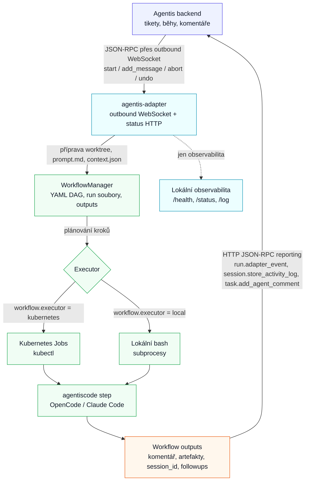

# Agentis Adapter

Adapter propojuje ticket systém **Agentis** s CLI coding agenty, hlavně OpenCode a Claude Code. Agentis do adapteru posílá JSON-RPC příkazy přes outbound WebSocket spojení iniciované adapterem, adapter připraví pracovní prostředí pro task, spustí workflow a průběžně vrací aktivitu, komentáře a artefakty zpět do Agentisu.

## Co Adapter Dělá

- Drží outbound WebSocket spojení na Agentis, takže může běžet i za NATem.
- Přijímá JSON-RPC metody `start`, `add_message`, `abort` a `undo`.
- Pro task umí založit nebo znovu použít git worktree a task větev.
- Spouští deklarativní workflow, ve kterém je agent typicky jedním z kroků.
- Streamuje aktivitu agenta do Agentisu jako activity log.
- Po doběhnutí zapisuje completion komentář, přílohy, diff, artefakty a followup akce.
- Poskytuje lokální HTTP endpointy pouze pro observabilitu.



> [!NOTE]
> Adapter nemá veřejné HTTP JSON-RPC API. HTTP server slouží jen pro `/health`, `/status`, `/log` a `/runs/{run_id}/log`.

## Požadavky

- Python `>=3.13,<3.14`
- Poetry
- Přístup k Agentis API a tokenu
- Pro kroky spouštějící agenta dostupné CLI nástroje v prostředí executorů podle použitého adaptéru (`opencode`, `claude`, `claude-p`)
- Pro workflow executor `kubernetes` funkční `kubectl` a platný kube context

## Instalace

```bash
poetry install
```

Projekt publikuje dva CLI příkazy:

| Příkaz | Účel |
| --- | --- |
| `agentis-adapter` | Spustí adapter proces, WebSocket transport iniciovaný adapterem a status HTTP server. |
| `agentiscode` | Sjednocený wrapper nad OpenCode a Claude Code. Používá se samostatně i ve workflow krocích. |

## Spuštění Adapteru

Minimální konfigurace je přes `.env` nebo environment proměnné:

```bash
export AGENTIS_ADAPTER_ID=my-adapter
export AGENTIS_API_TOKEN=...
export AGENTIS_WS_ENDPOINT=wss://agentis.cz/api/adapters/passive/ws
export AGENTIS_ENDPOINT=https://agentis.cz/api

poetry run agentis-adapter --id my-adapter
```

`--id` přepíše `AGENTIS_ADAPTER_ID` jen pro daný běh.

> [!IMPORTANT]
> Spouštění samotného FastAPI přes Uvicorn vystaví jen observační endpointy. Produkční transport JSON-RPC běží v příkazu `agentis-adapter`, který startuje WebSocket klienta i status HTTP server.

## Konfigurace

| Proměnná | Default | Význam |
| --- | --- | --- |
| `AGENTIS_ENDPOINT` | `https://agentis.cz/api` | HTTP JSON-RPC endpoint Agentisu pro reporting. |
| `AGENTIS_API_TOKEN` / `AGENTIS_TOKEN` | `1234` | Bearer token pro Agentis API a WebSocket. `AGENTIS_API_TOKEN` má přednost. |
| `AGENTIS_SERVICE_TOKEN` | prázdné | Volitelný service token používaný při telemetrii z `agentiscode`. |
| `AGENTIS_WS_ENDPOINT` | `wss://agentis.cz/api/adapters/passive/ws` | WebSocket endpoint Agentisu pro adapter. Pro ne-localhost musí být `wss://`. |
| `AGENTIS_ADAPTER_ID` | prázdné | Identita adapteru vůči Agentisu. Povinné, pokud není předaná přes `--id`. |
| `ADAPTER_HOST` / `ADAPTER_PORT` | `0.0.0.0` / `8001` | Lokální status HTTP server. |
| `ADAPTER_PUBLIC_URL` | prázdné | Volitelná veřejná URL adapteru pro odkazy a integrace. |
| `ADAPTER_WORKTREE_ROOT` | `<repo>/worktrees` | Kořen pro task worktrees. |
| `ADAPTER_PROJECT_RUN_ROOT` | `/tmp/agentis` | Adresář run souborů pro project scope a pojmenovaná workflow. |
| `ADAPTER_BUNDLED_WORKFLOW_DIR` | `<repo>/workflows` | Fallback workflow šablony zabalené v adapteru. |
| `ADAPTER_NAMESPACE_PREFIX` | `Task` | Prefix namespace pro workflow běhy. |
| `ADAPTER_SHUTDOWN_GRACE_PERIOD` | `0` | Čekání na doběhnutí běžících agentů/workflow při shutdownu. `0` znamená bez limitu. |
| `WORKFLOW_EXECUTOR` | `kubernetes` | Default executor workflow kroků: `kubernetes` nebo `local`. |
| `KUBECTL_COMMAND` | `kubectl` | Příkaz použitý Kubernetes executorem. |
| `AGENTISCODE_COMMAND` | `agentiscode` | Načítaná setting hodnota pro wrapper; bundled workflow dnes volá přímo `agentiscode`. |
| `AGENTISCODE_ADAPTER` | `opencode` | Načítaná setting hodnota; `agentiscode` CLI aktuálně vyžaduje `--adapter` a bundled `run-agent` vybírá adaptér podle modelu. |
| `AGENTIS_WS_HEARTBEAT_INTERVAL` | `30` | Heartbeat WebSocket spojení v sekundách. |
| `AGENTIS_WS_MAX_MESSAGE_SIZE` | `67108864` | Maximální velikost WebSocket zprávy. |
| `AGENTIS_WS_RECONNECT_INITIAL_DELAY` | `1` | Počáteční reconnect delay v sekundách. |
| `AGENTIS_WS_RECONNECT_MAX_DELAY` | `30` | Maximální reconnect delay v sekundách. |
| `AGENTIS_WS_RECONNECT_MAX_ATTEMPTS` | `0` | Maximální počet reconnect pokusů. `0` znamená bez limitu. |

## JSON-RPC Kontrakt

Agentis posílá adapteru příkazy přes WebSocket jako JSON-RPC 2.0. Adapter odpovídá zpět přes tentýž transport, pokud request obsahoval `id`.

| Metoda | Co dělá |
| --- | --- |
| `start` | Připraví worktree nebo run context a spustí workflow run. |
| `add_message` | Spustí workflow run nad follow-up zprávou, typicky s návazností na uložené `session_id`. |
| `abort` | Zastaví běžící workflow. |
| `undo` | Vrátí worktree do source snapshotu pořízeného před posledním během. |

Nevalidní parametry vrací standardní `Invalid params`. Busy workflow nad stejným taskem typicky vrací konflikt, protože pro jeden task smí běžet jen jedno workflow najednou.

### Důležitá Pole Kontextu

`context` se validuje přes Pydantic modely v `common/models.py`. Prakticky důležitá pole:

| Pole | Význam |
| --- | --- |
| `run_id`, `task_id`, `title` | Povinná identifikace runu a tasku. |
| `user_prompt`, `description`, `context_mode` | Zdroj promptu. Při `context_mode: comments` se přidá historie komentářů. |
| `working_dir` | Hlavní adresář projektu; pro task scope se z něj odvodí git repository root. |
| `base_branch`, `project_github_repo`, `ide` | Git base větev, GitHub repo pro workflow a volitelný IDE odkaz s `[%WORKDIR%]`. |
| `headers` | Volitelné hlavičky tasku; workflow je dostane jako `TASK_HEADER_*` env proměnné. |
| `attachments` | Přílohy tasku nebo follow-up zprávy; adapter je materializuje do worktree a přidá do promptu blok `<attachments>`. |
| `adapter.scope` | `task`/`worktree` vytvoří nebo znovu použije task worktree; `project` běží přímo v `working_dir` a použije `project.yaml`. |
| `adapter.branch` | Přepíše název task větve; default je `task-<task_id>`. |
| `adapter.runtime` | `local` vynutí lokální workflow executor. Prázdná hodnota nebo `workflow` používá executor z YAML/env. |
| `adapter.workflow` | Spustí pojmenované workflow `.agentis/workflows/<name>.yaml`, typicky followup akci. |
| `adapter.agent`, `adapter.model`, `adapter.effort` | Předává se workflow krokům jako `AGENTIS_AGENT`, `AGENTIS_MODEL`, `AGENTIS_EFFORT`. |
| `adapter.task_status` | Volitelný vstupní status; workflow komentáře typicky nastavují stav přes output `agent_comment.status`. |
| `adapter.auto_merge` | Signál pro automatický merge dostupný ve workflow jako `AGENTIS_AUTO_MERGE`. |

## Běhový Režim

Adapter používá workflow runtime pro každý `start` i `add_message`. Projektově specifická logika běhu agenta, přípravy prostředí, testů, commitu, pull requestu a úklidu patří do YAML workflow souborů. Adapter workflow načte, vyřeší dědičnost, připraví run soubory, naplánuje kroky podle závislostí a po dokončení aplikuje outputs do Agentisu.

Výběr workflow souboru:

- `context.adapter.workflow` použije pojmenovaný soubor `.agentis/workflows/<name>.yaml`, typicky followup akci.
- `context.adapter.scope == "project"` použije `.agentis/workflows/project.yaml` a přeskočí vytváření task worktree.
- Ostatní task běhy používají `.agentis/workflows/default.yaml`.

`start` a `add_message` se vrací rychle. Samotné workflow běží na pozadí a průběh se hlásí přes adapter eventy.

> [!WARNING]
> `kubernetes` není adapter runtime. Kubernetes se vybírá jako workflow executor přes YAML nebo `WORKFLOW_EXECUTOR`; `context.adapter.runtime = "local"` pouze vynutí lokální executor.

## Workflow Soubory

Workflow YAML se hledá v `.agentis/workflows/` v projektu. Pokud projekt vlastní soubor nemá, adapter může použít bundled fallback z `workflows/` v tomto repozitáři.

| Soubor | Použití |
| --- | --- |
| `default.yaml` | Běžný task run nad worktree a task větví. |
| `project.yaml` | Project scope, běh přímo nad projektem bez task worktree. |
| `<name>.yaml` | Pojmenované workflow spuštěné přes `context.adapter.workflow`, například followup akce. |
| `_base.yaml` | Sdílený základ pro `extends`; samostatně se nespouští. |

Bundled workflow v `workflows/` obsahují `_base.yaml`, `default.yaml` a `project.yaml`. Tento repozitář má zároveň vlastní projektová workflow v `.agentis/workflows/` včetně `merge.yaml` a `close.yaml`; ta mají při běhu nad tímto projektem přednost před fallbackem. Projekty si mohou dodat vlastní workflow soubory pro merge, close, Slack nebo jinou projektovou automatizaci.

Workflow soubor se načte a vyhodnotí jednou na začátku runu. Pozdější změny YAML v běžícím worktree už daný run neovlivní.

## Workflow Executory

Executor určuje, kde fyzicky běží jednotlivé kroky. Lze ho nastavit v YAML (`workflow.executor`) nebo globálně přes `WORKFLOW_EXECUTOR`.

| Executor | Popis |
| --- | --- |
| `kubernetes` | Každý krok běží jako `batch/v1 Job` přes `kubectl`. Vyžaduje image a platný kube context. |
| `local` | Každý krok běží jako lokální bash subprocess na hostu adapteru. Je jednodušší na vývoj, ale bez izolace. |

Oba executory spouští krok přes bash wrapper se striktním režimem `set -euo pipefail`, aplikují `envFiles`, nastaví pracovní adresář a sbírají logy.

> [!CAUTION]
> Lokální executor běží pod uživatelem adapter procesu a nemá sandbox. Nepoužívejte ho pro nedůvěryhodný kód bez další izolace.

## Workflow YAML Přehled

Minimální workflow:

```yaml
version: 1
extends: _base
workflow:
  executor: local
  workingDir: "[%WORKDIR%]"
  steps:
    - name: Run agent
      uses: run-agent
```

Důležité části workflow:

| Pole | Význam |
| --- | --- |
| `version` | Povinně `1`. |
| `extends` | Volitelná jedna úroveň dědičnosti z jiného workflow souboru. |
| `workflow.executor` | `kubernetes` nebo `local`. |
| `workflow.image` | Default image pro Kubernetes executor. |
| `workflow.imagePullSecrets` | Kubernetes `imagePullSecrets` pro Job pod. |
| `workflow.deleteNamespace` | Po úspěšném Kubernetes workflow smaže namespace runu. |
| `workflow.workingDir` | Pracovní adresář kroků. |
| `workflow.timeoutSeconds` | Default timeout kroku. |
| `workflow.ttlSecondsAfterFinished` | Default TTL dokončených Kubernetes Jobů. |
| `workflow.maxParallel` | Maximální počet současně běžících kroků. |
| `workflow.envFiles` | Soubory sourcované před během kroku. |
| `workflow.env` | Společné environment proměnné. |
| `workflow.mounts` | Kubernetes volume konfigurace. |
| `workflow.stepTemplates` | Sdílené šablony kroků používané přes `uses`. |
| `workflow.followups` | Akce nabídnuté po úspěšném completion komentáři. |
| `workflow.steps` | Seznam kroků workflow. |

Schema je striktní. Neznámé klíče jsou chyba při načtení workflow.

### Kroky

Krok obsahuje bash skript (`run`) nebo odkaz na šablonu (`uses`). Volitelně může definovat závislosti, podmínky, outputs a retry chování.

```yaml
- name: Create pull request
  needs: ["Run tests"]
  if: GITHUB_REPO && TESTS_OK == 'true'
  retries: 1
  run: gh pr create --fill
  outputs:
    - type: url
      label: Pull request
      valueFrom: .agentis/outputs/pull-request-url
```

| Pole kroku | Význam |
| --- | --- |
| `name` | Lidský název kroku. Při použití `needs` musí být názvy unikátní. |
| `needs` | Závislosti na dříve definovaných krocích. Bez `needs` je workflow sekvenční. |
| `uses` | Použití šablony z `workflow.stepTemplates`. |
| `run` | Bash skript kroku. |
| `if` | Podmínka spuštění kroku. |
| `continueOnError` | Selhání kroku nezastaví celé workflow. |
| `retries` | Počet opakování selhaného kroku. |
| `always` | Krok běží i po fatálním selhání dřívějšího kroku. |
| `image` | Image jen pro tento krok u Kubernetes executoru. |
| `workingDir` | Pracovní adresář jen pro tento krok. |
| `timeoutSeconds` | Timeout jen pro tento krok. |
| `ttlSecondsAfterFinished` | TTL Kubernetes Jobu jen pro tento krok. |
| `resources` | Kubernetes resources pro kontejner kroku. |
| `env` | Environment proměnné jen pro tento krok. |
| `outputs` | Soubory, ze kterých adapter po doběhu čte výsledky. |

### Dědičnost A Šablony

`extends: <name>` načte rodičovský soubor ze stejného adresáře a sloučí ho s potomkem. Podporovaná je jen jedna úroveň dědičnosti. Skaláry přepisuje potomek, `env` a `stepTemplates` se mergují po klíčích a seznamy `envFiles`, `mounts`, `imagePullSecrets` se slučují s přepisem položek podle `name`. `steps` a `followups` se nedědí, protože popisují konkrétní chování daného workflow.

`stepTemplates` slouží pro sdílené kroky. Šablona definuje běžná pole kroku a konkrétní krok ji použije přes `uses`. Krok může hodnoty ze šablony přepsat.

Bundled `_base.yaml` obsahuje šablonu `run-agent`, která spouští `agentiscode`, zapisuje finální odpověď a uloží `session_id` jako workflow output.

### Paralelní Kroky

Workflow je DAG nad `steps`. Bez `needs` se kroky chovají sekvenčně. Paralelismus se zapíná explicitně přes `needs` a limituje přes `workflow.maxParallel`.

```yaml
workflow:
  maxParallel: 2
  steps:
    - name: Backend tests
      run: poetry run pytest

    - name: Frontend tests
      needs: []
      run: npm test

    - name: Publish report
      needs: ["Backend tests", "Frontend tests"]
      run: ./scripts/report.sh
```

Autor workflow odpovídá za bezpečnost paralelních zápisů do worktree a output adresářů.

### Interpolace Tokenů

Ve string hodnotách YAML lze použít tokeny `[%NAME%]`. Neznámý token je chyba.

| Token | Význam |
| --- | --- |
| `NAMESPACE` | Kubernetes namespace runu. |
| `WORKDIR` | Absolutní cesta k worktree nebo pracovnímu adresáři. |
| `RUN_DIR` | Adresář run souborů. |
| `MAIN_DIR` | Hlavní adresář projektu. |
| `RUN_ID` | Identifikace runu. |
| `TASK_ID`, `TASK_NUMBER`, `TASK_TITLE` | Identifikace tasku. |
| `BRANCH`, `BASE_BRANCH` | Task větev a cílová větev. |
| `GITHUB_REPO` | GitHub repozitář projektu. |

Každý krok zároveň dostává odpovídající environment proměnné a Agentis proměnné jako `AGENTIS_RUN_ID`, `AGENTIS_TASK_ID`, `AGENTIS_RUN_DIR`, `AGENTIS_PROMPT_FILE`, `AGENTIS_CONTEXT_FILE`, `AGENTIS_SESSION_ID`, `AGENTIS_MODEL`, `AGENTIS_AGENT`, `AGENTIS_EFFORT` a `AGENTIS_AUTO_MERGE`. `context.headers` se flattenují do `TASK_HEADER_*`, například `headers.slack.channel_id` na `TASK_HEADER_SLACK_CHANNEL_ID`.

### Podmínky

`if` používá jednoduchou gramatiku nad proměnnými:

```yaml
- name: Create virtualenv
  if: ENV_READY != 'true'
  run: python3.13 -m venv .venv
```

Podporované jsou holé proměnné, negace `!VAR`, porovnání `==` a `!=`, spojky `&&` a `||`. Závorky nejsou podporované. Neznámá proměnná se chová jako prázdný string.

### Outputs

Kroky komunikují s adapterem přes soubory. Cesty jsou relativní k output rootu runu a nesmí z něj utéct.

| Typ | Význam |
| --- | --- |
| `agent_comment` | Tělo completion komentáře a cílový status tasku. |
| `session_id` | Session id uložené do Agentisu pro pozdější resume. |
| `url` | Odkaz přiložený ke komentáři. |
| `text` | Textová příloha komentáře. |
| `artifact` | Soubor přiložený jako artefakt. |
| `var` | Proměnná použitelná v `if`, env dalších kroků a followup podmínkách. |

Outputs úspěšných kroků se aplikují po konci workflow v pořadí kroků v YAML. Outputs přeskočených nebo selhaných kroků se neaplikují.

U `agent_comment` lze `status` zadat číslem nebo aliasem `backlog`, `todo`, `in_progress`, `in_review`, `done`, `cancelled`, `blocked`. `name` nastaví autora staticky, `nameFrom` ho přečte ze souboru. U běžného task workflow je output root worktree; u `scope=project` a pojmenovaných workflow je output root externí run dir `ADAPTER_PROJECT_RUN_ROOT/<run_id>/<attempt>/`.

#### Artefakty

Soubory předáte do Agentisu přes output typu `artifact`. `path` je cesta k existujícímu souboru nebo glob maska relativně k output rootu runu, `name` je název artefaktu zobrazený v Agentisu. Artifacty se přiloží k poslednímu `agent_comment`; bez komentáře adapter jen zaloguje, že outputy zpracoval.

Jeden soubor v běžném task workflow:

```yaml
- name: Generate report
  run: |
    mkdir -p .agentis/outputs
    ./scripts/build-report > .agentis/outputs/report.json
    printf 'Report je přiložený jako artefakt.\n' > .agentis/outputs/final-comment.md
  outputs:
    - type: agent_comment
      bodyFrom: .agentis/outputs/final-comment.md
    - type: artifact
      name: report
      path: .agentis/outputs/report.json
```

Více známých souborů můžete předat jako více `artifact` outputů:

```yaml
- name: Collect artifacts
  run: |
    mkdir -p .agentis/outputs
    cp dist/app.tar.gz .agentis/outputs/app.tar.gz
    cp coverage/coverage.xml .agentis/outputs/coverage.xml
    printf 'Build a coverage jsou v artefaktech.\n' > .agentis/outputs/final-comment.md
  outputs:
    - type: agent_comment
      bodyFrom: .agentis/outputs/final-comment.md
    - type: artifact
      name: build-archive
      path: .agentis/outputs/app.tar.gz
    - type: artifact
      name: coverage-report
      path: .agentis/outputs/coverage.xml
```

V `scope=project` nebo pojmenovaném workflow zapisujte soubory typicky do `$AGENTIS_RUN_DIR/outputs` a v `path` použijte cestu relativní k run diru, např. `outputs/report.json`.

Když počet souborů není dopředu známý, použijte v `path` masku. Adapter rozbalí masku na samostatné artifacty, vezme jen soubory uvnitř output rootu a adresáře přeskočí. Při více shodách se `name` použije jako prefix názvu každého artefaktu.

```yaml
- name: Collect reports
  run: |
    mkdir -p .agentis/outputs/reports
    cp reports/*.json .agentis/outputs/reports/
    printf 'Reporty jsou v artefaktech.\n' > .agentis/outputs/final-comment.md
  outputs:
    - type: agent_comment
      bodyFrom: .agentis/outputs/final-comment.md
    - type: artifact
      name: reports
      path: .agentis/outputs/reports/*.json
```

Pro zachování adresářové struktury použijte rekurzivní masku, například `path: .agentis/outputs/reports/**/*.json`. Pokud chcete předat velké množství souborů jako jeden artefakt, zabalte je do archivu a předejte archiv jedním `artifact` outputem.

### Followup Akce

`workflow.followups` definuje akce nabídnuté v completion komentáři po úspěšném workflow. Kliknutí na akci spustí `start` s `context.adapter.workflow = "<workflow>"`.

```yaml
followups:
  - title: Git merge
    if: PR_CREATED && !AGENTIS_AUTO_MERGE
    prompt: Sloučit změny z task větve do hlavní větve.
    workflow: merge
    continue_previous_run: false
```

Podmínka `if` u followupu se vyhodnocuje nad `workflow.env`, runtime env jako `AGENTIS_AUTO_MERGE`, built-in hodnotami a `var` outputs dokončeného runu. Workflow bez `followups` žádné akce nenabízí.

### Error Handling

Selhaný krok bez zvláštního nastavení přepne workflow do fail-fast režimu. Nové běžné kroky se už nespouští, běžící kroky doběhnou a relevantní `always` kroky se ještě mohou provést.

| Nastavení | Chování |
| --- | --- |
| `continueOnError: true` | Selhání kroku nezastaví workflow, ale outputs daného kroku se nepoužijí. |
| `retries: N` | Krok se po selhání zopakuje až `N` krát. |
| `always: true` | Krok se spustí i po fatálním selhání předchozích kroků. |

`abort` není workflow failure. Aktivní kroky se zastaví, pending kroky se nespouští a outputs se neaplikují.

`always` krok při selhání dostane navíc `AGENTIS_WORKFLOW_STATUS=failed` a `AGENTIS_FAILED_STEP=<název kroku>`, takže může vytvořit failure komentář nebo diagnostickou přílohu.

## Lokální Mock Workflow

Pro ruční ověření JSON-RPC payloadu a workflow dispatch bez WebSocket transportu slouží skript:

```bash
poetry run python scripts/mock_workflow_request.py "uprav README" --runtime local --scope project --workflow test --print-only
```

Defaultně nevolá Agentis callbacks (`AGENTIS_ENDPOINT` ignoruje). Přepínač `--print-only` jen vypíše JSON-RPC payload; pro reálné spuštění ho odeberte a přidejte `--wait`. Přepínač `--agentis-callbacks` povolí reálné callbacky do Agentisu.

## Agentiscode

`agentiscode` je sjednocený CLI wrapper nad OpenCode a Claude Code. Používá se ve workflow šabloně `run-agent`, ale lze ho spustit i ručně.

```bash
poetry run agentiscode --adapter opencode --model openai/gpt-5 "uprav README"
echo "dlouhý prompt" | poetry run agentiscode --adapter claude --json
```

| Adapter | Aliasy | Podkladový agent |
| --- | --- | --- |
| `opencode` | `oc` | `opencode run --format json` |
| `claude` | `claudecode`, `claude-code`, `cloud`, `cc` | `claude --print --output-format stream-json` |
| `claude-p` | `claudep`, `cp` | `claude-p ... --output-format stream-json` |

Bez `--json` píše finální odpověď agenta na stdout a aktivitu na stderr. S `--json` streamuje sjednocené eventy jako JSON Lines. S parametry `--task-id`, `--run-id` a Agentis tokeny umí průběžně posílat telemetrii do Agentisu.

Použití:

```bash
poetry run agentiscode --adapter <adapter> [volby] "prompt pro agenta"
poetry run agentiscode --adapter <adapter> [volby] < prompt.md
```

### Volby Agentiscode

| Volba | Význam |
| --- | --- |
| `--adapter NAME`, `-a NAME` | Povinný agent runtime. Hodnoty: `opencode`, `claude`, `claude-p` a jejich aliasy z tabulky výše. |
| `--model MODEL`, `-m MODEL` | Model předaný podkladovému agentovi. |
| `--effort EFFORT`, `-e EFFORT` | Reasoning effort. U Claude se předá jako `--effort`, u OpenCode jako `--variant`. |
| `--agent AGENT` | Pojmenovaný agent, mode nebo profil podkladového CLI. |
| `--cwd PATH` | Pracovní adresář běhu. Default je aktuální adresář. |
| `--resume SESSION_ID` | Naváže na existující agent session. |
| `--timeout SECONDS` | Časový limit běhu v sekundách. `0` znamená bez limitu; default je `0`. |
| `--json` | Streamuje sjednocené eventy jako JSON Lines na stdout místo textového rendereru. |
| `--task-id TASK_ID` | Agentis task id. Zapne telemetrii, založí run a průběžně posílá aktivitu do Agentisu. |
| `--run-id RUN_ID` | Existující Agentis run id. Telemetrie se zapíše do něj místo založení nového runu. Vyžaduje `--task-id`. |
| `--task-status STATUS_ID` | Stav tasku nastavený při finálním `task.add_agent_comment`. Použije se jen s `--last-message-to-comment`. |
| `--last-message-to-comment` | Po skončení běhu pošle poslední odpověď agenta jako primary komentář do Agentisu. |
| `--primary-session BOOL` | Označí agent session jako primární v Agentisu. Default je `true`; přijímá například `true/false`, `1/0`, `yes/no`, `on/off`. |
| `--agentis-api URL` | Agentis JSON-RPC endpoint. Default je `$AGENTIS_ENDPOINT`; povinné při použití `--task-id` nebo `--run-id`. |
| `--agentis-token TOKEN` | Agentis user/API auth token. Default je `$AGENTIS_API_TOKEN`, fallback `$AGENTIS_TOKEN`. |
| `--agentis-service-token TOKEN` | Agentis service token pro runtime callbacky. Default je `$AGENTIS_SERVICE_TOKEN`. |
| `--final-output PATH` | Po skončení běhu uloží finální odpověď agenta do souboru. |
| `--session-output PATH` | Uloží agent session id do souboru, jakmile je známé. |
| `prompt` | Zadání pro agenta jako poziční argumenty. Když chybí, načte se ze stdin; prázdný prompt je chyba. |

## Observabilita

Lokální HTTP server je read-only a slouží pro provozní dohled.

| Endpoint | Význam |
| --- | --- |
| `GET /health` | Liveness check. |
| `GET /status` | Snapshot stavu WebSocket spojení, runů a statistik. |
| `GET /log?after=&limit=` | Globální log adapteru. |
| `GET /runs/{run_id}/log?after=&limit=` | Log konkrétního runu. |

Stav sessions a runů je in-memory. Restart procesu registry zahodí, což je záměrné.

## Práce S Repozitářem

Orientační struktura projektu:

| Cesta | Obsah |
| --- | --- |
| `app/` | CLI vstupy a FastAPI service container. |
| `common/` | Sdílená logika adapteru, JSON-RPC, workflow a reporting do Agentisu. |
| `agentiscode/` | Instalovatelný entrypoint wrapperu `agentiscode`. |
| `opencode/`, `claude/` | Integrace konkrétních CLI agentů. |
| `.agentis/workflows/` | Workflow konfigurace pro běhy tohoto repozitáře. |
| `workflows/` | Bundled workflow fallback šablony. |
| `scripts/` | Pomocné provozní a testovací skripty. |
| `docs/` | Původní detailnější dokumenty. |
| `tests/` | End-to-end a jednotkové testy. |

Vývojové příkazy:

```bash
poetry run pytest -q
poetry run ruff check .
```

## Časté Problémy

| Problém | Řešení |
| --- | --- |
| `AGENTIS_ADAPTER_ID is required` | Nastavit `AGENTIS_ADAPTER_ID` nebo spustit `agentis-adapter --id ...`. |
| WebSocket odmítá `ws://` | Pro ne-localhost endpoint použít `wss://`. |
| Workflow executor `kubernetes` vyžaduje image | Doplnit `workflow.image` nebo přepnout na `executor: local`. |
| `Workflow file not found` | Doplnit `.agentis/workflows/<soubor>.yaml` nebo použít bundled fallback. |
| `uses unknown step template` | Zkontrolovat `extends` a existenci šablony v `workflow.stepTemplates`. |
| `unknown or future needs` | `needs` smí odkazovat jen na dříve definované kroky. |
| Workflow je `busy` | Pro daný task už běží workflow. Počkat na doběhnutí nebo zavolat `abort`. |
| Output se nepropsal | Zkontrolovat, že soubor vznikl, není prázdný, krok uspěl a cesta je v output rootu. |

## Bezpečnostní Poznámky

- `AGENTIS_API_TOKEN`, `AGENTIS_TOKEN` ani `agentis_token` se nemají vracet v odpovědích ani logovat.
- Reporting do Agentisu je best-effort. Selhání reportingu samo o sobě nemá shodit běh agenta.
- Local workflow executor spouští příkazy na hostu adapteru, proto vyžaduje důvěryhodné prostředí nebo externí izolaci.
