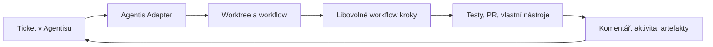

# Agentis Adapter

**Proměňte tickety v řízené běhy AI coding agentů.**

Agentis Adapter propojuje [Agentis](https://agentis.cz) s projektovými workflow. Vývojář zadá práci v Agentisu, adapter připraví izolovaný workspace, spustí deklarované kroky a vrátí průběh i výsledek zpět k ticketu.

Místo dalšího chatovacího okna získáte opakovatelný proces pro práci agentů nad skutečnými repozitáři.

## Proč Agentis Adapter

- **Libovolné kroky**: testy, buildy, deploye i volitelní coding agenti v jednom workflow.
- **Workflow patří projektu**: přípravu prostředí, testy, commit, pull request i úklid definujete v YAML vedle kódu.
- **Izolované běhy**: každý task může dostat vlastní git worktree a větev.
- **Průběh přímo u ticketu**: aktivita, komentáře, odkazy a artefakty se vracejí do Agentisu.
- **Navazující konverzace**: další zprávy mohou pokračovat v uložené session agenta.
- **Runtime podle vašich potřeb**: workflow kroky lze spouštět lokálně, v Dockeru nebo jako Kubernetes Joby.
- **Funguje i za NATem**: spojení s Agentisem iniciuje adapter přes odchozí WebSocket.



## Rychlý Start

### 1. Požadavky

- Python `3.13`
- [Poetry](https://python-poetry.org/)
- přístupový token a ID adapteru z Agentisu
- Docker nebo `kubectl` pouze v případě, že je používá zvolený executor

### 2. Instalace

```bash
git clone https://github.com/ondrejnov/agentis-adapter.git
cd agentis-adapter
poetry install
```

### 3. Připojení k Agentisu

Vytvořte `.env` v kořeni repozitáře:

```dotenv
AGENTIS_ADAPTER_ID=my-adapter
AGENTIS_API_TOKEN=your-token
AGENTIS_ENDPOINT=https://agentis.cz/api
AGENTIS_WS_ENDPOINT=wss://agentis.cz/api/adapters/passive/ws

# Nejjednodušší varianta pro lokální vývoj
WORKFLOW_EXECUTOR=local
```

Spusťte adapter:

```bash
poetry run agentis-adapter
```

Adapter se sám připojí k Agentisu a začne přijímat tasky. Není potřeba vystavovat veřejný příchozí port.

> [!IMPORTANT]
> Lokální executor spouští workflow přímo pod uživatelem adapteru a neposkytuje sandbox. Pro nedůvěryhodný kód použijte Docker, Kubernetes nebo jinou izolaci.

## Workflow Jako Součást Projektu

Každý repozitář může řídit chování agenta pomocí `.agentis/workflows/default.yaml`. Díky tomu není postup ukrytý v adapteru a může se verzovat společně s projektem.

Příklad agentního workflow:

```yaml
version: 1
extends: _base
workflow:
  env:
    TASK_NUMBER: "[%TASK_NUMBER%]"
    TASK_TITLE: "[%TASK_TITLE%]"
    GITHUB_REPO: "[%GITHUB_REPO%]"
    AGENT_BROWSER_SCREENSHOT_DIR: "[%WORKDIR%]/.screenshots"
    IS_SANDBOX: 1
    PYTHONPATH: "[%WORKDIR%]/api"
    PATH: "[%WORKDIR%]/api/.venv/bin:/root/.local/bin:/usr/local/bin:/usr/bin:/bin"
  steps:
    - name: Check environment
      run: |
        mkdir -p .agentis/outputs
        if [ -x api/.venv/bin/python ]; then
          printf 'true' > .agentis/outputs/env-ready
        else
          printf 'false' > .agentis/outputs/env-ready
        fi
      outputs:
        - type: var
          name: ENV_READY
          valueFrom: .agentis/outputs/env-ready

    - name: Copy environment files
      if: ENV_READY != 'true'
      run: |
        if [ -f "$MAIN_DIR/api/.env" ]; then
          cp "$MAIN_DIR/api/.env" api/.env
        fi
        if [ -f "$MAIN_DIR/web/.env" ]; then
          cp "$MAIN_DIR/web/.env" web/.env
        fi

    - name: Create runtime directories
      if: ENV_READY != 'true'
      run: mkdir -p runtime/uploads .screenshots data/files

    - name: Install web dependencies
      if: ENV_READY != 'true'
      run: |
        cd web
        lock_hash=$(sha256sum package-lock.json | cut -d' ' -f1)
        if [ "$(cat node_modules/.lock-hash 2>/dev/null || true)" != "$lock_hash" ]; then
          npm ci --prefer-offline --no-audit --no-fund
          printf '%s' "$lock_hash" > node_modules/.lock-hash
        fi

    - name: Install API dependencies
      if: ENV_READY != 'true'
      run: |
        cd api
        [ -x .venv/bin/python ] || python3.13 -m venv .venv
        lock_hash=$(sha256sum poetry.lock | cut -d' ' -f1)
        if [ "$(cat .venv/.lock-hash 2>/dev/null || true)" != "$lock_hash" ]; then
          VIRTUAL_ENV="$PWD/.venv" poetry install --no-interaction --no-ansi --sync
          printf '%s' "$lock_hash" > .venv/.lock-hash
        fi

    - name: Run agent
      run: |
        OUTPUT_DIR="${RUN_AGENT_OUTPUT_DIR:-$AGENTIS_RUN_DIR/outputs}"
        mkdir -p "$OUTPUT_DIR"
        MODEL="${AGENTIS_MODEL:-openai/gpt-5.6-luna}"
        printf 'Agent - %s' "$MODEL" > "$OUTPUT_DIR/agent-name"
        case "$(printf '%s' "$MODEL" | tr '[:upper:]' '[:lower:]')" in
          *claude*) ADAPTER=claude ;;
          *) ADAPTER=opencode ;;
        esac
        agentiscode ${RUN_AGENT_FLAGS:-} --adapter "$ADAPTER" \
          ${AGENTIS_SESSION_ID:+--resume "$AGENTIS_SESSION_ID"} \
          --model "$MODEL" \
          --effort "$AGENTIS_EFFORT" \
          --run-id "$AGENTIS_RUN_ID" \
          --task-id "$AGENTIS_TASK_ID" \
          --final-output "$OUTPUT_DIR/final-comment.md" \
          --session-output "$OUTPUT_DIR/session-id" \
          < "$AGENTIS_PROMPT_FILE" \
          | ${RUN_AGENT_STREAM_FILTER:-cat}
      outputs:
        - type: agent_comment
          bodyFrom: .agentis/outputs/final-comment.md
          status: in_review
        - type: session_id
          valueFrom: .agentis/outputs/session-id

    - name: Commit changes
      run: |
        git add -A
        if git diff --cached --quiet; then
          echo "No changes to commit."
        else
          git -c user.name="Coding Agent" -c user.email="agent@example.com" \
            commit -m "TASK: #${TASK_NUMBER} - ${TASK_TITLE}"
        fi

    - name: Create pull request
      run: |
        mkdir -p .agentis/outputs
        rm -f .agentis/outputs/pull-request-url
        if [ -z "$GITHUB_REPO" ]; then
          echo "No GitHub repository configured; skipping pull request."
          exit 0
        fi
        if git ls-remote --exit-code --heads origin "$BRANCH" >/dev/null 2>&1; then
          git pull --rebase origin "$BRANCH"
        fi
        git fetch origin "$BASE_BRANCH"
        if [ "$(git rev-list --count FETCH_HEAD..HEAD)" -eq 0 ]; then
          echo "No commits ahead of ${BASE_BRANCH}; skipping pull request."
          exit 0
        fi
        git push --set-upstream origin "${BRANCH}:refs/heads/${BRANCH}"
        if gh pr list --state open --head "$BRANCH" --base "$BASE_BRANCH" --limit 1 \
          --json url --jq '.[0].url // empty' > .agentis/outputs/pull-request-url \
          && [ -s .agentis/outputs/pull-request-url ]; then
          echo "Pull request already exists: $(cat .agentis/outputs/pull-request-url)"
        else
          gh pr create --base "$BASE_BRANCH" --head "$BRANCH" \
            --title "${TASK_TITLE:-$BRANCH}" \
            --body "Automated changes for task #${TASK_NUMBER}." \
            > .agentis/outputs/pull-request-url
        fi
      outputs:
        - label: Pull Request
          type: url
          valueFrom: .agentis/outputs/pull-request-url
        - type: var
          name: PR_CREATED
          valueFrom: .agentis/outputs/pull-request-url

    - name: Auto merge task branch
      if: PR_CREATED && AGENTIS_AUTO_MERGE
      run: |
        mkdir -p .agentis/outputs
        git fetch origin "$BASE_BRANCH"
        if ! git rebase "refs/remotes/origin/${BASE_BRANCH}"; then
          opencode run --model openai/gpt-5.6 "fix git conflict" \
            | tee .agentis/outputs/auto-merge-conflict-resolution.txt
          if ! GIT_EDITOR=true git rebase --continue; then
            git rebase --abort
            exit 1
          fi
        fi
        if ! git -C "$MAIN_DIR" rebase "$BRANCH"; then
          git -C "$MAIN_DIR" stash push
          git -C "$MAIN_DIR" rebase "$BRANCH"
          git -C "$MAIN_DIR" stash pop
        fi
        git -C "$MAIN_DIR" push origin "${BASE_BRANCH}:refs/heads/${BASE_BRANCH}"
        {
          printf 'Zamergoval jsem task větev do hlavní větve.\n'
          if [ -s .agentis/outputs/auto-merge-conflict-resolution.txt ]; then
            printf '\nMerge narazil na git conflict, který jsem řešil přes AI resolver.\n'
          fi
        } > .agentis/outputs/auto-merge-comment.md
      outputs:
        - type: agent_comment
          bodyFrom: .agentis/outputs/auto-merge-comment.md
          status: done
          name: Merge agent

    - name: Report auto merge failure
      always: true
      run: |
        [ "${AGENTIS_WORKFLOW_STATUS:-success}" = "failed" ] || exit 0
        mkdir -p .agentis/outputs
        {
          printf 'Auto merge task větve selhal v kroku "%s".\n' "$AGENTIS_FAILED_STEP"
          if [ -s .agentis/outputs/auto-merge-conflict-resolution.txt ]; then
            printf '\nRebase narazil na konflikt, který se nepodařilo vyřešit ani přes AI resolver; rebase byl zrušen (git rebase --abort) a task větev zůstává beze změny.\n'
          fi
        } > .agentis/outputs/auto-merge-failure-comment.md
      outputs:
        - type: agent_comment
          bodyFrom: .agentis/outputs/auto-merge-failure-comment.md
          name: Merge agent
        - label: AI conflict resolver
          type: text
          valueFrom: .agentis/outputs/auto-merge-conflict-resolution.txt

    - name: Deploy preview
      run: |
        mkdir -p .agentis/outputs
        NAMESPACE="preview-${TASK_NUMBER}"
        APP_URL="https://${NAMESPACE}.preview.example.com"
        kubectl apply -f - <<EOF
        apiVersion: platform.example.com/v1alpha1
        kind: PreviewEnvironment
        metadata:
          name: application
          namespace: ${NAMESPACE}
        spec:
          image: registry.example.com/agents/coding-agent:latest
          workingDir: $(pwd)
          command: ["./run-preview.sh"]
          port: 8080
          runId: "${AGENTIS_RUN_ID}"
        EOF
        printf '%s\n' "$APP_URL" > .agentis/outputs/app-url
      outputs:
        - label: Preview
          type: url
          valueFrom: .agentis/outputs/app-url

  followups:
    - title: Merge changes
      if: PR_CREATED && !AGENTIS_AUTO_MERGE
      prompt: Merge the task branch into the base branch.
      workflow: merge
    - title: Code review
      prompt: Review the proposed changes.
      workflow: code-review
    - title: Remove preview
      prompt: Remove the preview environment, worktree and task branch.
      workflow: close
```

Příklad je záměrně obecný. Cesty, příkazy, image, preview doménu a Kubernetes resource nahraďte hodnotami svého projektu. Workflow může přidat paralelní kroky, podmínky, retry, artefakty i další navazující akce. Pokud projekt vlastní workflow nemá, použije adapter dodané výchozí šablony.

| Soubor | Použití |
| --- | --- |
| `.agentis/workflows/default.yaml` | Standardní task ve vlastním worktree |
| `.agentis/workflows/project.yaml` | Běh přímo nad projektem |
| `.agentis/workflows/<name>.yaml` | Vlastní navazující akce, například merge nebo release |

Adapter navíc přijímá synchronní JSON-RPC `approve`. Agentis předá execution context, stabilní `approval_id`, Bash command a volitelný deadline; pojmenované workflow z `context.adapter.workflow` musí přes jediný `var` output `APPROVED` vrátit přesně `1` nebo `0`. Bundled `workflows/approval.yaml` poskytuje výchozí AI review a projekt jej může přepsat.

Kompletní formát, executory a outputs popisuje [dokumentace workflow](docs/workflow.md).

## Volitelný AgentisCode Krok

Coding agent není součástí ani povinnou závislostí adapteru. Samostatný balíček `agentiscode` lze nainstalovat do hosta nebo workflow image a použít jako jeden volitelný krok:

```bash
agentiscode --adapter opencode --model openai/gpt-5 "oprav failing test"
agentiscode --adapter claude --model claude-sonnet-4-5 "zreviduj API"
```

`agentiscode` nadále podporuje `--task-id`, `--run-id`, průběžný reporting do Agentisu a souborové outputs. Adapter jej neimportuje ani neinstaluje; workflow může stejně dobře spustit jiný příkaz nebo žádného agenta.

## Provoz

Adapter vedle WebSocket spojení nabízí malé read-only HTTP rozhraní pro dohled:

| Endpoint | Účel |
| --- | --- |
| `GET /health` | Liveness check |
| `GET /status` | Stav spojení a běžících workflow |
| `GET /log` | Provozní log adapteru |
| `GET /runs/{run_id}/log` | Log konkrétního běhu |

Výchozí adresa je `http://localhost:8001`. HTTP server neslouží k přijímání tasků; ty přicházejí přes WebSocket z Agentisu.

## Dokumentace

- [Adapter a komunikace s Agentisem](docs/adapter.md)
- [Workflow, executory a outputs](docs/workflow.md)
- [Koncept lokálního workflow executoru](docs/koncept-local-workflow-executor.md)

## Vývoj

```bash
poetry run pytest -q
poetry run ruff check .
```
