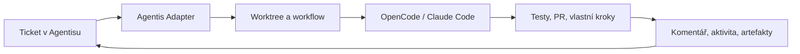

# Agentis Adapter

**Proměňte tickety v řízené běhy AI coding agentů.**

Agentis Adapter propojuje [Agentis](https://agentis.cz) s OpenCode a Claude Code. Vývojář zadá práci v Agentisu, adapter připraví izolovaný workspace, spustí agenta podle workflow projektu a vrátí průběh i výsledek zpět k ticketu.

Místo dalšího chatovacího okna získáte opakovatelný proces pro práci agentů nad skutečnými repozitáři.

## Proč Agentis Adapter

- **Jeden vstup pro různé agenty**: OpenCode, Claude Code a vlastní kroky v jednom workflow.
- **Workflow patří projektu**: přípravu prostředí, testy, commit, pull request i úklid definujete v YAML vedle kódu.
- **Izolované běhy**: každý task může dostat vlastní git worktree a větev.
- **Průběh přímo u ticketu**: aktivita, komentáře, odkazy a artefakty se vracejí do Agentisu.
- **Navazující konverzace**: další zprávy mohou pokračovat v uložené session agenta.
- **Runtime podle vašich potřeb**: workflow kroky lze spouštět lokálně, v Dockeru nebo jako Kubernetes Joby.
- **Funguje i za NATem**: spojení s Agentisem iniciuje adapter přes odchozí WebSocket.



## Rychlý Start

### 1. Požadavky

- Python `3.13`
- [Poetry](https://python-poetry.org/)
- přístupový token a ID adapteru z Agentisu
- alespoň jeden podporovaný agent CLI (`opencode`, `claude` nebo `claude-p`)
- Docker nebo `kubectl` pouze v případě, že je používá zvolený executor

### 2. Instalace

```bash
git clone https://github.com/ondrejnov/agentis-adapter.git
cd agentis-adapter
poetry install
```

### 3. Připojení k Agentisu

Vytvořte `.env` v kořeni repozitáře:

```dotenv
AGENTIS_ADAPTER_ID=my-adapter
AGENTIS_API_TOKEN=your-token
AGENTIS_ENDPOINT=https://agentis.cz/api
AGENTIS_WS_ENDPOINT=wss://agentis.cz/api/adapters/passive/ws

# Nejjednodušší varianta pro lokální vývoj
WORKFLOW_EXECUTOR=local
```

Spusťte adapter:

```bash
poetry run agentis-adapter
```

Adapter se sám připojí k Agentisu a začne přijímat tasky. Není potřeba vystavovat veřejný příchozí port.

> [!IMPORTANT]
> Lokální executor spouští workflow přímo pod uživatelem adapteru a neposkytuje sandbox. Pro nedůvěryhodný kód použijte Docker, Kubernetes nebo jinou izolaci.

## Workflow Jako Součást Projektu

Každý repozitář může řídit chování agenta pomocí `.agentis/workflows/default.yaml`. Díky tomu není postup ukrytý v adapteru a může se verzovat společně s projektem.

Minimální projektové workflow postavené nad dodanou šablonou `_base.yaml`:

```yaml
version: 1
extends: _base
workflow:
  executor: local
  workingDir: "[%WORKDIR%]"
  steps:
    - name: Run agent
      uses: run-agent

    - name: Run tests
      run: poetry run pytest -q
```

Workflow může přidat paralelní kroky, podmínky, retry, artefakty i navazující akce, například vytvoření nebo sloučení pull requestu. Pokud projekt vlastní workflow nemá, použije adapter dodané výchozí šablony.

| Soubor | Použití |
| --- | --- |
| `.agentis/workflows/default.yaml` | Standardní task ve vlastním worktree |
| `.agentis/workflows/project.yaml` | Běh přímo nad projektem |
| `.agentis/workflows/<name>.yaml` | Vlastní navazující akce, například merge nebo release |

Kompletní formát, executory a outputs popisuje [dokumentace workflow](docs/workflow.md).

## Sjednocené Agent CLI

Součástí projektu je `agentiscode`, tenká společná vrstva nad podporovanými coding agenty. Lze ji použít ve workflow i samostatně:

```bash
poetry run agentiscode --adapter opencode --model openai/gpt-5 "oprav failing test"
poetry run agentiscode --adapter claude --model claude-sonnet-4-5 "zreviduj API"
```

`agentiscode` sjednocuje stream událostí, finální odpověď a session ID. Workflow tak nemusí řešit rozdíly mezi jednotlivými CLI.

## Provoz

Adapter vedle WebSocket spojení nabízí malé read-only HTTP rozhraní pro dohled:

| Endpoint | Účel |
| --- | --- |
| `GET /health` | Liveness check |
| `GET /status` | Stav spojení a běžících workflow |
| `GET /log` | Provozní log adapteru |
| `GET /runs/{run_id}/log` | Log konkrétního běhu |

Výchozí adresa je `http://localhost:8001`. HTTP server neslouží k přijímání tasků; ty přicházejí přes WebSocket z Agentisu.

## Dokumentace

- [Adapter a komunikace s Agentisem](docs/adapter.md)
- [Workflow, executory a outputs](docs/workflow.md)
- [Koncept lokálního workflow executoru](docs/koncept-local-workflow-executor.md)

## Vývoj

```bash
poetry run pytest -q
poetry run ruff check .
```
