# Jak funguje Agentis adapter

## K čemu adapter slouží

Adapter je most mezi ticket systémem **Agentis** a CLI coding agenty (Claude Code, OpenCode, sjednocený wrapper `agentiscode`). Přijímá od Agentisu JSON-RPC příkazy (`start`, `add_message`, `abort`, `undo`), pro task připraví git worktree a spustí deklarativní workflow. Agent, příprava prostředí, testy, commit, pull request i úklid jsou kroky workflow; jejich průběh a výstupy adapter posílá zpět do Agentisu.

Klíčové zdrojáky:

| Soubor | Role |
| --- | --- |
| `app/cli.py` | Entrypoint `agentis-adapter` — spuštění transportů |
| `common/rpc/passive_websocket.py` | WebSocket transport k Agentisu pro příjem JSON-RPC |
| `common/rpc/dispatcher.py` | JSON-RPC dispatch — validace, mapování metod, chybové kódy |
| `common/rpc/jsonrpc.py` | `AgentJsonRpcService` — logika metod `start`/`add_message`/`abort`/`undo` |
| `common/adapter_base.py` | `BaseAdapterService` — společné workspace a reporting operace |
| `common/git_adapter.py` | `GitAdapterService` — worktree a branch per task |
| `common/agentis.py` | `AgentisJsonRpcClient` — HTTP JSON-RPC klient na Agentis backend |
| `common/workflow/` | Workflow runtime a executory (viz [docs/workflow.md](workflow.md)) |

## Architektura v kostce

```mermaid
flowchart LR
    agentis["Agentis backend"]
    websocket["Outbound WebSocket<br/>common/rpc/passive_websocket.py"]
    dispatcher["JSON-RPC dispatcher<br/>common/rpc/dispatcher.py"]
    service["AgentJsonRpcService<br/>start / add_message / abort / undo"]
    git["GitAdapterService<br/>worktree, branch, snapshots"]
    workflow["Workflow runtime<br/>WorkflowManager + YAML kroky"]
    executor{"Executor kroků"}
    k8s["Kubernetes Job<br/>kubectl"]
    bash["Lokální bash<br/>subproces"]
    reporting["AgentisJsonRpcClient<br/>eventy, aktivita, komentáře, session_id"]
    status["FastAPI observabilita<br/>/health, /status, /log"]

    agentis -->|"JSON-RPC příkazy<br/>wss, spojení iniciuje adapter"| websocket
    websocket --> dispatcher --> service --> git --> workflow
    workflow --> executor
    executor -->|"kubernetes"| k8s
    executor -->|"local"| bash
    k8s --> reporting
    bash --> reporting
    reporting -->|"HTTP JSON-RPC"| agentis
    service -.->|"snapshot stavu"| status

    classDef external fill:#eef2ff,stroke:#4f46e5,color:#111827
    classDef transport fill:#f8fafc,stroke:#64748b,color:#111827
    classDef adapter fill:#ecfeff,stroke:#0891b2,color:#111827
    classDef runtime fill:#f0fdf4,stroke:#16a34a,color:#111827
    classDef report fill:#fff7ed,stroke:#ea580c,color:#111827
    class agentis external
    class websocket,dispatcher transport
    class service,git,status adapter
    class workflow,executor,k8s,bash runtime
    class reporting report
```

Důležité vlastnosti:

- **Spojení iniciuje adapter** — drží outbound WebSocket na Agentis (`AGENTIS_WS_ENDPOINT`), Agentis do adapteru nevolá žádné HTTP. Adapter tak může běžet za NATem.
- **HTTP server adapteru je jen observabilita** — `/health`, `/status`, `/log`, `/runs/{run_id}/log`. Žádné JSON-RPC přes HTTP.
- **Stav je in-memory** — registry workflow runů nepřežije restart procesu, záměrně bez perzistence.

## Vstupní body

| Příkaz | Co dělá |
| --- | --- |
| `agentis-adapter [--id <adapter-id>]` | Spustí adapter proces: FastAPI app (observabilita) + WebSocket transport |
| `agentiscode …` | Samostatný CLI wrapper nad OpenCode/Claude Code (viz níže) |

Serving adapter je **jeden generický** (`app/adapter_api.py`), žádný `--adapter` výběr. Definuje `create_app()` (FastAPI app se službami na `app.state`) a tabulku `_DISPATCH` (JSON-RPC metody → handler) a `adapter_factory` instancuje `GitAdapterService` napřímo — adapter dělá jen git worktree/snapshot plumbing.

Konkrétní CLI agent (`opencode` / `claude` / `claude-p`) se nevybírá na serving straně, ale až ve workflow kroku `run-agent` (`workflows/_base.yaml`), který podle modelu zavolá `agentiscode --adapter <X>`. Mapování názvů agenta žije v `common/agentiscode.py` (`ADAPTER_ALIASES`):

| Adapter (`agentiscode -a`) | Aliasy | Agent |
| --- | --- | --- |
| `claude` | `claudecode`, `claude-code`, `cloud`, `cc` | `claude --print --output-format stream-json` |
| `claude-p` | `claudep`, `cp` | `claude-p ... --output-format stream-json` — stejný engine jako `claude`, jen bez `--print -` |
| `opencode` | `oc` | `opencode run --format json` |

## Transport: WebSocket iniciovaný adapterem

`PassiveWebSocketClient` (`common/rpc/passive_websocket.py`):

- připojuje se na `AGENTIS_WS_ENDPOINT` s hlavičkami `Authorization: Bearer <AGENTIS_TOKEN>` a `X-Agentis-Adapter-Id: <AGENTIS_ADAPTER_ID>`; pro ne-localhost vyžaduje `wss://`,
- každou přijatou zprávu parsne jako JSON-RPC 2.0, zvaliduje parametry přes Pydantic model z `_DISPATCH` a handler spustí v threadu (`asyncio.to_thread`); odpověď posílá zpět jen pokud request měl `id`,
- při výpadku reconnectuje s exponenciálním backoffem (konfigurovatelné `AGENTIS_WS_RECONNECT_*`),
- **graceful shutdown**: první SIGTERM/SIGINT zavře WebSocket (žádné nové zprávy), rozpracovaný dispatch doběhne a pak se čeká na běžící agenty a workflow až `ADAPTER_SHUTDOWN_GRACE_PERIOD` sekund (0 = bez limitu). Druhý signál ukončí proces okamžitě.

## JSON-RPC metody

| Metoda | Parametry | Co dělá |
| --- | --- | --- |
| `start` | `context` (+ `fork_from_session_id`) | Připraví worktree a spustí workflow; vrací `run` + provedené adapter kroky |
| `add_message` | `run_id`, `context`, `message`, `attachments` | Spustí workflow run s follow-up promptem; agentí krok může navázat přes uložené session ID |
| `abort` | `context` | Zruší běžící workflow a jeho aktivní kroky |
| `undo` | `context` | Vrátí worktree do source snapshotu pořízeného před posledním během |

Chyby vrací `AgentJsonRpcException` s kódem, který dispatcher mapuje na HTTP-like status (`404` → not found, `>=500`/`-32603` → internal, jinak 400). Nevalidní parametry = standardní `-32602 Invalid params`.

Centrální vstup do metod je `AgentJsonRpcService` (`common/rpc/jsonrpc.py`). `start` i `add_message` připraví workspace a vždy předají řízení `WorkflowManager`u. `context.adapter.runtime` nerozhoduje o routingu: hodnota `local` pouze vynutí lokální workflow executor, zatímco prázdná hodnota nebo `workflow` ponechá výběr na `workflow.executor` a `WORKFLOW_EXECUTOR`.

## Workflow runtime

Průběh `start` / `add_message`:

1. **Workspace** — `GitAdapterService` pro task scope založí nebo znovu použije worktree `<ADAPTER_WORKTREE_ROOT>/<task-safe-id>` na task větvi. Project scope běží přímo v `context.working_dir`.
2. **Prompt a přílohy** — adapter složí prompt z kontextu nebo follow-up zprávy a materializuje přílohy do workspace.
3. **Výběr workflow** — pojmenovaná akce použije `<name>.yaml`, project scope `project.yaml`, ostatní runy `default.yaml`. Projektový soubor má přednost před bundled fallbackem z `ADAPTER_BUNDLED_WORKFLOW_DIR`.
4. **Spuštění** — `WorkflowManager` pořídí source snapshot pro `undo`, zmrazí YAML a na pozadí spustí jeho DAG přes Kubernetes Joby nebo lokální bash procesy. `start` / `add_message` proto vrací rychle a bez `session_id`.
5. **Reporting** — workflow posílá `run.adapter_event`; agentí krok s `agentiscode` může navíc průběžně posílat session ID a aktivitu. Po doběhnutí manager aplikuje deklarované outputs, například completion komentář, přílohy, artefakty a followup akce.

Per task běží maximálně jedno workflow; souběžný start vrací chybu 409 (busy). `abort` zastaví jeho aktivní kroky a `undo` obnoví worktree ze snapshotu posledního runu. Detailně viz [docs/workflow.md](workflow.md).

## `agentiscode`

`agentiscode` je samostatně použitelný příkaz (`app/agentiscode.py`) a zároveň standardní agentí krok dodávaných workflow. Sjednocuje `opencode run` a `claude` do proudu `AgentEvent` (viz `common/agentiscode.py`). Když dostane údaje pro Agentis, `common/agentis_telemetry.py` průběžně posílá session ID a aktivitu; finální odpověď a session ID současně zapisuje do souborů pro workflow outputs.

## Komunikace s Agentisem

Veškerý reporting jde přes `AgentisJsonRpcClient` (HTTP JSON-RPC na `AGENTIS_ENDPOINT`, Bearer `AGENTIS_TOKEN`). Používané metody:

| Metoda | Kdy |
| --- | --- |
| `run.adapter_event` | Průběh lifecycle kroků a běhu agenta (`kind` + `status` started/success/failed) |
| `run.store_session_id` | Po založení session — Agentis si session přiřadí k runu |
| `session.session_created` | První ohlášení nové agentí session |
| `session.store_activity_log` | Průběžný snapshot aktivity agenta (zprávy/tool cally) |
| `task.add_agent_comment` | Completion komentář s přílohami, artefakty, status změnou a followup akcemi |

Selhání reportingu běh agenta neshazuje (best-effort, loguje se na stderr). `agentis_token` se nikdy nevrací v API odpovědích ani nelogu­je (`RunStatePayload.safe_dump()`).

## Konfigurace (env / `.env`)

| Proměnná | Default | Význam |
| --- | --- | --- |
| `AGENTIS_ENDPOINT` | `http://127.0.0.1:8891` | HTTP JSON-RPC endpoint Agentisu |
| `AGENTIS_TOKEN` | `1234` | Bearer token pro HTTP i WebSocket |
| `AGENTIS_WS_ENDPOINT` | — | `ws(s)://` endpoint pro WebSocket spojení adapteru (povinné) |
| `AGENTIS_ADAPTER_ID` | — | Identita adapteru vůči Agentisu (povinné; lze předat `--id`) |
| `ADAPTER_HOST` / `ADAPTER_PORT` | `0.0.0.0` / `8001` | Status HTTP server |
| `ADAPTER_WORKTREE_ROOT` | `<repo>/worktrees` | Kořen pro task worktrees |
| `ADAPTER_PROJECT_RUN_ROOT` | `/tmp/agentis` | Run soubory project scope a pojmenovaných workflow (mimo worktree) |
| `ADAPTER_BUNDLED_WORKFLOW_DIR` | `<repo>/workflows` | Fallback workflow, pokud projekt nemá vlastní soubor |
| `ADAPTER_SHUTDOWN_GRACE_PERIOD` | `0` | Sekundy čekání na doběhnutí práce při shutdownu (0 = bez limitu) |
| `WORKFLOW_EXECUTOR` | `kubernetes` | Executor workflow kroků (`kubernetes` / `local`), pokud ho neurčí YAML |
| `KUBECTL_COMMAND` | `kubectl` | Příkaz pro Kubernetes executor |
| `AGENTISCODE_COMMAND` | `agentiscode` | Příkaz CLI wrapperu |
| `AGENTISCODE_ADAPTER` | `opencode` | Default podkladový agent wrapperu |
| `AGENTIS_WS_HEARTBEAT_INTERVAL`, `AGENTIS_WS_MAX_MESSAGE_SIZE`, `AGENTIS_WS_RECONNECT_*` | viz `common/config.py` | Ladění WebSocket transportu |

## Observabilita

- `GET /health` — liveness.
- `GET /status` — snapshot status registru: stav WebSocket spojení, běžící/dokončené runy, statistiky od startu.
- `GET /log?after=&limit=` — globální log adapteru; `GET /runs/{run_id}/log` — log konkrétního runu.

## Testy

End-to-end testy JSON-RPC chování jdou přes `fastapi.testclient.TestClient` v `tests/test_api.py` (helper v `tests/support.py` routuje payloady na dispatcher, jako by přišly WebSocketem). Workflow režim pokrývá `tests/test_workflow.py`, jednotliví agenti `tests/test_claudecode.py`, `tests/test_opencode.py`, `tests/test_agentiscode*.py`. Spouštění: `poetry run pytest -q` + `poetry run ruff check .`.
