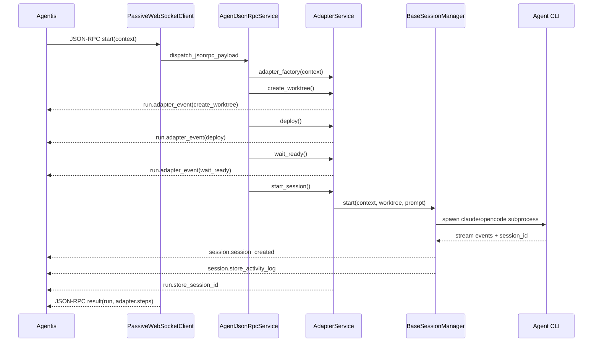
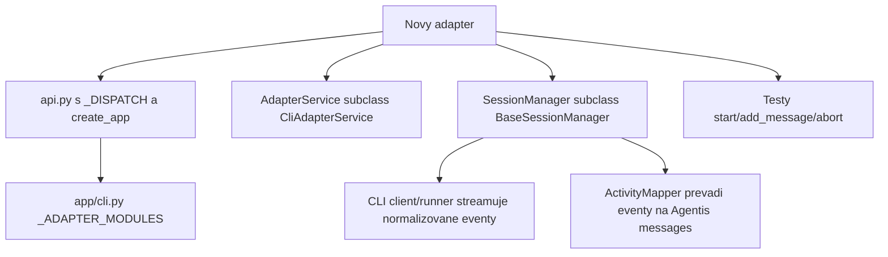

# Vyvojarska dokumentace adapteru

Tento dokument popisuje, jak funguje Agentis adapter, co v kodu znamena adapter, session a runtime, a co je potreba doplnit pri pridani noveho adapteru.

## Slovnik

- **Agentis** je ridici aplikace a ticket system. Posila adapteru JSON-RPC pozadavky a prijima zpet udalosti, komentare, activity log a vysledky.
- **Adapter proces** je dlouho bezici Python proces spusteny prikazem `agentis-adapter --adapter <typ>`. Sam se pripoji do Agentisu pres odchozi WebSocket a neposloucha verejny inbound RPC endpoint.
- **Adapter service** je trida, ktera umi pripravit prostredi pro jeden konkretni run: git worktree, volitelny deploy, cekani na runtime, start session, pridani zpravy, abort, merge a cleanup.
- **Runtime** je skutecne prostredi, kde bezi agent. Typicky lokalni CLI proces (`claude`, `opencode run`) nebo CLI spustene uvnitr Kubernetes podu pres `kubectl exec`.
- **Session** je dlouhodobejsi konverzacni kontext konkretniho agenta. V Agentisu se persistuje `session_id`, aby dalsi `add_message` navazal na stejnou agenti session.
- **Run** je jedno zpracovani tasku nebo jedne zpravy v Agentisu. Run nese `run_id`, `task_id`, prompt, metadata projektu a volby adapteru.
- **Activity log** je prubezny log udalosti agenta normalizovany do formatu, ktery Agentis umi zobrazit jako prubeh prace.
- **Adapter event** je stavova udalost posilana do Agentisu metodou `run.adapter_event`, napr. `create_worktree`, `deploy`, `start_session`, `commit`, `dev_server`.

## Vstupni bod

Proces startuje pres `app/cli.py`:

```bash
poetry run agentis-adapter --adapter opencode
poetry run agentis-adapter --adapter claude
```

`app/cli.py` podle argumentu importuje modul adapteru:

- `opencode` -> `opencode.api`
- `claude` nebo `claudecode` -> `claude.api`

Kazdy `*.api` modul definuje:

- `_DISPATCH`, mapu JSON-RPC metod na Pydantic parametry a handler v `AgentJsonRpcService`.
- `_configure_services`, kde se vytvori session manager a `AgentJsonRpcService` s factory na konkretni adapter service.
- `create_app`, ktere vola `common.adapter_app.create_adapter_app`.

`create_adapter_app` nevytvari klasicke verejne API. FastAPI aplikace funguje hlavne jako service container v `app.state` a poskytuje jen `/health`.

## Transport

Adapter prijima externi JSON-RPC jen pres pasivni WebSocket klienta v `common/rpc/passive_websocket.py`.

```mermaid
flowchart LR
    A[Agentis] -- JSON-RPC request --> W[Passive WebSocket]
    W -- dispatch_jsonrpc_payload --> D[_DISPATCH]
    D --> S[AgentJsonRpcService]
    S --> F[adapter_factory(context)]
    F --> AD[Concrete AdapterService]
    AD -- AgentisJsonRpcClient --> A
```

Dulezite dusledky:

- Adapter se k Agentisu pripojuje odchozim spojenim pres `AGENTIS_WS_ENDPOINT`.
- Agentis identifikuje spojeni pres `AGENTIS_ADAPTER_ID` a `Authorization: Bearer <AGENTIS_TOKEN>`.
- JSON-RPC odpoved se vraci zpet po stejnem WebSocket spojeni.
- Prubezne udalosti, komentare a activity log se neposilaji jako odpoved na WebSocket request, ale samostatnymi JSON-RPC volanimi z adapteru do Agentisu pres `AGENTIS_ENDPOINT`.

## JSON-RPC metody

Spolecne handlery jsou v `common/rpc/jsonrpc.py` ve tride `AgentJsonRpcService`.

| Metoda | Ucel |
| --- | --- |
| `start` | Pripravi worktree/prostredi, spusti agenti session a ulozi `session_id`. |
| `add_message` | Navaze na existujici `session_id` a posle dalsi prompt. |
| `question` | Rozhrani pro odpoved na otazku agenta; CLI adaptery ho aktualne neimplementuji. |
| `approve` | Jednoduche potvrzeni rozhodnuti. |
| `git_merge` | Rebase/merge task vetve do base branche, push a cleanup. |
| `abort` | Zastavi bezici session/proces. |
| `close` | Uklidi session, worktree, branch a pripadne Kubernetes prostredi. |
| `provider.sync_usage` | Jen u OpenCode adapteru; synchronizace usage dat provideru. |

Parametry se validuji Pydantic modely v `common/models.py`. Hlavni payload je `AgentExecutionContextPayload`.

## Start flow

`start` je hlavni flow pro novy task.



Poradi kroku v `AgentJsonRpcService.start`:

1. Vytvori `RunStatePayload` pouze v pameti.
2. Vytvori konkretni adapter pres `adapter_factory(context)`.
3. U task scope zavola `create_worktree`.
4. Pokud adapter vyzaduje `requires_agentis_init`, zavola `init_agentis`.
5. Zavola `deploy`.
6. Zavola `wait_ready` a ocekava `url`.
7. Zavola `start_session`.
8. Zaregistruje `session_id` do `SessionContextRegistry`.
9. Vrati JSON-RPC odpoved s prubehem adapter steps.

Kazdy krok obaluje `_run_adapter_step`, ktery posila `run.adapter_event` se stavem `started`, `success` nebo `failed`.

## Adapter service vrstva

Adaptery jsou trivrstva dedicnost; Kubernetes deploy mechanika je samostatny
helper mimo strom:

```
BaseAdapterService            common/adapter_base.py   (minimalni)
└── GitAdapterService         common/git_adapter.py    (git/worktree)
    ├── CliAdapterService     common/cli_adapter.py
    │   ├── OpenCodeAdapterService
    │   └── ClaudeCodeAdapterService
    └── KubernetesAdapterService  common/kubernetes_runtime.py
```

`KubernetesRuntime` (`common/kubernetes/runtime.py`) NENI adapter — je to
collaborator s Kubernetes deploy mechanikou, ktery si `CliAdapterService`
(v `kubernetes` modu) i `KubernetesAdapterService` composnou. Zadny adapter si
deploy nepujcuje od jineho adapteru.

`BaseAdapterService` je zamerne minimalni — prijme kontext, mluvi s Agentisem
(`AgentisJsonRpcClient`, emitovani adapter eventu, persist session_id) a deklaruje
lifecycle, ktery konkretni adaptery implementuji. O gitu ani Kubernetes nevi.

`GitAdapterService` resi vsechno git:

- odvozeni nazvu branche z `task_id` nebo `context.adapter.branch`,
- vytvoreni nebo znovupouziti git worktree (`create_worktree`),
- `git_merge`,
- `close` a cleanup worktree/branche.

`KubernetesRuntime` resi vsechno Kubernetes:

- odvozeni namespace a ingress/URL,
- resolveni a `apply`/`delete` manifestu,
- volitelny lokalni `opencode web` runtime,
- `deploy`, `wait_ready`, `teardown`.

Adapter service musi implementovat tyto metody:

- `deploy()`
- `wait_ready()`
- `start_session()`
- `add_message()`
- `question_reply()` pokud ho dany runtime podporuje
- `abort()`

CLI adaptery pouzivaji spolecnou implementaci `common/cli_adapter.py::CliAdapterService`.

`CliAdapterService` dela:

- lokalni mod bez Kubernetes deploye,
- volitelny Kubernetes mod, kde se deleguje na `KubernetesRuntime`,
- sestaveni prvniho promptu z `user_prompt`, `description`, `comments` nebo `title`,
- start a resume session pres `BaseSessionManager`,
- abort a close.

Konkretni adaptery jsou velmi tenke:

- `opencode/adapter.py::OpenCodeAdapterService` nastavuje `runtime_label = "opencode"`.
- `claude/adapter.py::ClaudeCodeAdapterService` nastavuje `runtime_label = "claude"` a default run mode z `settings.claude_run_mode`.

## Session manager

Spolecny session lifecycle je v `common/session_manager.py::BaseSessionManager`.

```mermaid
flowchart TD
    START[start(context, worktree, prompt)] --> SNAP1[snapshot_sources_best_effort]
    SNAP1 --> PENDING[ulozit pending session pod docasnym klicem]
    PENDING --> THREAD[spustit background thread]
    THREAD --> STREAM[async stream CLI eventu]
    STREAM --> SID{prislo session_id?}
    SID -- ano --> BIND[_bind_session_id]
    BIND --> CREATED[session.session_created]
    STREAM --> MAP[activity mapper consume event]
    MAP --> LOG[session.store_activity_log]
    STREAM --> DONE{CLI dobehlo?}
    DONE --> FINISH[_finish_session_actions]
    FINISH --> COMMENT[task.add_agent_comment]
    COMMENT --> IDLE[run.adapter_event agent_idle]
```

`BaseSessionManager` je agnosticky k agentovi. Konkretni session manager musi dodat:

- `_AGENT_LABEL`, napr. `opencode` nebo `claude`,
- `_REMOTE_PKILL_PATTERN` pro zabiti procesu v Kubernetes podu,
- `_make_mapper(...)`, ktery vytvori activity mapper,
- `_build_client(...)`, ktery vytvori wrapper nad konkretnim CLI.

`start` vraci az ve chvili, kdy CLI oznami skutecne `session_id`. Do te doby je session ulozena pod docasnym `pending_key`. Timeout je `_AGENT_SESSION_START_TIMEOUT_SEC`.

`send` navazuje na existujici session a spousti novy CLI run s resume parametrem.

`abort` zabije lokalni process group nebo pri Kubernetes modu nejdriv ukonci lokalni `kubectl exec` stream a pak vola `pkill` uvnitr podu.

## CLI klient a mapper

Kazdy CLI runtime ma dve casti:

- klient/runner, ktery spousti subprocess a normalizuje raw vystup na eventy,
- activity mapper, ktery eventy prevadi na Agentis activity log.

OpenCode:

- `opencode/runner.py::OpenCodeRunner` spousti `opencode run <prompt> --format json`.
- `opencode/session_manager.py::OpenCodeSessionManager` predava model, agent, variant a resume session.
- `opencode/activity_mapper.py::OpenCodeActivityMapper` sklada activity log.

Claude:

- `claude/client.py::ClaudeCodeClient` spousti `claude --print - --output-format stream-json --verbose`.
- `claude/session_manager.py::ClaudeSessionManager` predava model, agent, effort a resume session.
- `claude/activity_mapper.py::ClaudeActivityMapper` sklada activity log.

Mapper musi z eventu postupne vytvaret seznam zprav ve formatu, ktery Agentis uklada pres `session.store_activity_log`. Session manager po kazde zmene vola `mapper.snapshot()` a posle cely aktualni snapshot do Agentisu.

## Git a scope

`AgentExecutionContextPayload.adapter.scope` urcuje praci s repozitarem:

| Scope | Chovani |
| --- | --- |
| `task` | Default. Adapter vytvori worktree mimo hlavni repo a task branch `task-<task_id>`. |
| `worktree` | V modelu povoleno, chova se prakticky jako task scope v `GitAdapterService`. |
| `project` | Nepousti se task worktree. Bezi primo v aktualnim projektovem repozitari a `git_merge`/`close` cleanup se preskakuje. |

Task scope:

- repository root se zjisti z `context.working_dir`,
- worktree cesta je `settings.worktree_root / safe(task_id)`,
- branch je `context.adapter.branch` nebo `task-<task_id>`,
- base ref je `context.base_branch` nebo `origin/<base_branch>`.

Project scope:

- namespace je `project-<project_slug>`,
- pouziva se manifest `opencode-project.yaml`,
- worktree a branch cleanup se preskakuje.

## Kubernetes runtime

`common/kubernetes/runtime.py::KubernetesRuntime` je helper s Kubernetes deploy
mechanikou. Composnou si ho `common/kubernetes_runtime.py::KubernetesAdapterService`
(adapter pro OpenCode web runtime) i `CliAdapterService` v Kubernetes modu.

Zodpovednosti:

- resolvuje manifest z `.agentis/deploy.yaml`, `settings.manifest_path` nebo `context.adapter.manifest`,
- nahrazuje placeholdery pres `common/kubernetes/manifest_parser.py`,
- vola `kubectl apply`,
- ceka na URL OpenCode runtime,
- umi lokalni `opencode web` fallback pro `adapter.runtime = "local"`, pokud neexistuje local deploy config,
- vytvari `opencode.json` z template, pokud `requires_agentis_init = True`.

CLI adaptery v defaultnim lokalnim modu Kubernetes nepouziji. Pri `context.adapter.runtime = "kubernetes"` deleguji `deploy`, `wait_ready` a teardown na `KubernetesRuntime` a samotne CLI spousti pres `kubectl exec` v podu.

## Dokonceni session

Po dobehnuti CLI runu `BaseSessionManager`:

- doposle posledni activity log,
- vytahne finalni text posledni assistant zpravy,
- provede `_finish_session_actions`, pokud session nebyla abortnuta,
- zapise diff attachment pres source snapshot helpery,
- posle `task.add_agent_comment` s finalnim textem, screenshoty a expected artifacts,
- posle `run.adapter_event` typu `<agent>_idle`.

`_finish_session_actions` u tasku s `project_github_repo` navic:

- prida IDE link, pokud `context.ide` existuje,
- commitne zmeny v task worktree,
- zalozi nebo najde GitHub PR,
- spusti `run-dev.sh` lokalne nebo pres `kubectl exec`,
- prida attachment na dev server.

## Jak pridat novy CLI adapter

Minimalni cesta je zkopirovat vzor OpenCode/Claude a doplnit jen runtime-specificke casti.



Checklist:

1. Vytvor balicek, napr. `myagent/`.
2. Pridej `myagent/adapter.py` se subclassou `CliAdapterService`.
3. Pridej `myagent/session_manager.py` se subclassou `BaseSessionManager`.
4. Pridej CLI klienta, ktery ma `stream(prompt, on_proc_started=...)` a atributy `session_id`, `last_usage`, `last_cost_usd`.
5. Pridej activity mapper s metodami `consume(event) -> bool` a `snapshot() -> list[dict]`.
6. Pridej `myagent/api.py` s `_DISPATCH`, `_configure_services` a `create_app`.
7. Zaregistruj adapter v `app/cli.py::_ADAPTER_MODULES`.
8. Pokud adapter podporuje Kubernetes runtime, nastav `_REMOTE_PKILL_PATTERN` a pouzij `kubectl_target` v klientovi.
9. Dopln testy pro JSON-RPC `start`, `add_message`, `abort` a zakladni mapovani activity logu.

Skeleton session manageru:

```python
from typing import Optional

from common.session_manager import BaseSessionManager, _AgentSession
from myagent.activity_mapper import MyAgentActivityMapper
from myagent.client import MyAgentClient, MyAgentRunConfig


class MyAgentSessionManager(BaseSessionManager):
    _AGENT_LABEL = "myagent"
    _REMOTE_PKILL_PATTERN = "myagent run"

    def _make_mapper(
        self,
        *,
        prompt: str,
        mode: str,
        cwd: str,
        session_id_hint: Optional[str] = None,
    ) -> MyAgentActivityMapper:
        return MyAgentActivityMapper(prompt=prompt, mode=mode, cwd=cwd, session_id_hint=session_id_hint)

    def _build_client(self, sess: _AgentSession, resume_id: Optional[str]) -> MyAgentClient:
        adapter_opts = sess.context.adapter
        return MyAgentClient(
            config=MyAgentRunConfig(
                cwd=sess.worktree,
                model=(adapter_opts.model if adapter_opts and adapter_opts.model else None),
                agent=(adapter_opts.agent if adapter_opts and adapter_opts.agent else None),
                resume_session_id=resume_id,
                kubectl_target=sess.kubectl_target,
                env={"IS_SANDBOX": "1"},
            )
        )
```

Skeleton adapter service:

```python
from common.cli_adapter import CliAdapterService


class MyAgentAdapterService(CliAdapterService):
    runtime_label = "myagent"
```

Skeleton `api.py`:

```python
from fastapi import FastAPI

from common.adapter_app import JsonRpcRoute, create_adapter_app
from common.config import Settings, get_settings
from common.models import AbortParams, AddMessageParams, ApproveParams, CloseParams, GitMergeParams, QuestionParams, StartParams
from common.rpc.jsonrpc import AgentJsonRpcService
from common.rpc.session_registry import SessionContextRegistry
from myagent.adapter import MyAgentAdapterService
from myagent.session_manager import MyAgentSessionManager


_DISPATCH = {
    "start": JsonRpcRoute(StartParams, "start"),
    "add_message": JsonRpcRoute(AddMessageParams, "add_message"),
    "question": JsonRpcRoute(QuestionParams, "question"),
    "approve": JsonRpcRoute(ApproveParams, "approve"),
    "git_merge": JsonRpcRoute(GitMergeParams, "git_merge"),
    "abort": JsonRpcRoute(AbortParams, "abort"),
    "close": JsonRpcRoute(CloseParams, "close"),
}


def _configure_services(app: FastAPI, settings: Settings, session_registry: SessionContextRegistry) -> None:
    session_manager = MyAgentSessionManager(settings=settings)
    app.state.myagent_session_manager = session_manager
    app.state.agent_jsonrpc_service = AgentJsonRpcService(
        settings=settings,
        session_registry=session_registry,
        adapter_factory=lambda context: MyAgentAdapterService(
            context=context,
            settings=settings,
            session_manager=session_manager,
        ),
    )


def create_app() -> FastAPI:
    return create_adapter_app(
        title="Agentis MyAgent Adapter",
        settings=get_settings(),
        configure_services=_configure_services,
    )
```

## Na co si dat pozor

- `session_id` musi prijit z CLI streamu rychle, jinak `start` timeoutne a session se abortne.
- `add_message` vyzaduje `context.session_id`; bez nej vraci JSON-RPC chybu 400.
- Adapter stav je jen v pameti procesu. Po restartu se ztrati lokalni registry a bezici session managery.
- Nikdy neposilej do logu ani odpovedi tokeny. Agentis token je konfiguracni secret.
- `question_reply` u CLI adapteru neni implementovane. Pokud novy agent umi interaktivni otazky, musi se doplnit az do adapter service a klienta.
- Pro lokalni CLI spousteni se pouziva `start_new_session=True`; abort zabiji celou process group.
- Pro Kubernetes CLI mod je nutne zabit i proces uvnitr podu pres `_REMOTE_PKILL_PATTERN`, nejen lokalni `kubectl exec` klient.
- Activity mapper ma vracet stabilni snapshot cele historie, ne jen delta posledni udalosti.
- `BaseSessionManager._finish_session_actions` muze commitovat zmeny a spoustet `run-dev.sh`; testuj chovani s `project_github_repo` i bez nej.

## Rychla mapa souboru

| Soubor | Role |
| --- | --- |
| `app/cli.py` | CLI entrypoint, vyber adapteru, start pasivniho WebSocket transportu. |
| `common/adapter_app.py` | Vytvori FastAPI service container a `/health`. |
| `common/rpc/passive_websocket.py` | Odchozi WebSocket klient do Agentisu. |
| `common/rpc/dispatcher.py` | JSON-RPC validace, dispatch a error mapping. |
| `common/rpc/jsonrpc.py` | Hlavni JSON-RPC business flow. |
| `common/models.py` | Pydantic payloady pro requesty a run state. |
| `common/adapter_base.py` | Git/worktree, Agentis eventy, merge a cleanup. |
| `common/cli_adapter.py` | Spolecny lifecycle pro lokalni nebo `kubectl exec` CLI adaptery. |
| `common/session_manager.py` | Background session lifecycle, streaming, finalizace. |
| `opencode/*` | OpenCode adapter, runner, session manager a mapper. |
| `claude/*` | Claude adapter, client, session manager a mapper. |
| `common/kubernetes_runtime.py` | Kubernetes/OpenCode web runtime a manifest workflow. |
